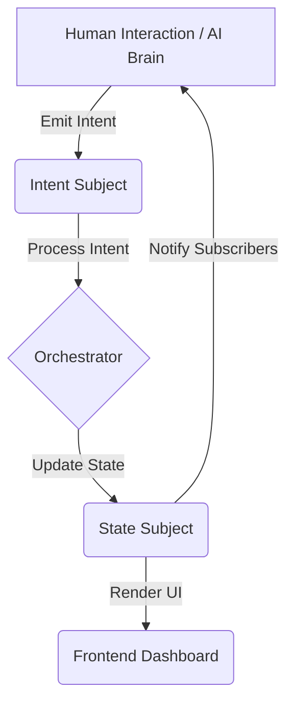

# Fool (Durak) Game - Reactive Engine

A fully autonomous and playable implementation of the classic Russian card game **Fool** (Durak), built using a reactive architecture and modern web technologies.

## 🃏 Game Features

- **Intelligent AI Bots**: Powered by Marie Curie, Isaac Newton, and Nikola Tesla – each tracks the table state and makes tactical moves.
- **Human Player Interface**: Take control of Albert Einstein and challenge the AI scientists.
- **Reactive Engine**: Built entirely on RxJS streams for state management, AI "thinking", and UI updates.
- **Autonomous Mode**: The bots can play against each other in a fully automated simulation.
- **Modern UI**: Dark-themed observer dashboard with real-time logs and animations (via Vite).

## 🏗️ Architecture Overview

The project follows a unidirectional reactive data flow pattern using **RxJS Observables**.

### Core Components:

1.  **State Management (`src/store.ts`)**:
    - **`table$`**: A `BehaviorSubject` containing the current game state (deck, hands, table, trumps).
    - **`intent$`**: A `Subject` where all actions (Attack, Defend, Pass, Take) are funneled.
    - **Orchestrator**: Subscribes to `intent$`, validates moves against standard Durak rules, and updates `table$`.

2.  **AI Brains (`src/player.ts`)**:
    - Each bot is a stream that monitors `table$`.
    - Uses logic from `src/helpers.ts` to find the "Best Attack" or "Best Defense".
    - Incorporates a `delay(1000)` pipe to make the game observable and human-readable.
    - Emits intents to the `intent$` stream.

3.  **Frontend (`src/main.ts` & `index.html`)**:
    - Subscribes to `table$` and `log$` to update the DOM in real-time.
    - Provides click handlers for the human player (Player 0) to emit intents to the orchestrator.

### Unidirectional Data Flow:



### RxJS Marble Diagram:
To visualize the autonomous flow with its built-in delays:

```text
Intent$:    --[A1]----------[D2]----------[B1]---->
              |              |              |
 (delay 1s)   v              v              v
Processing:   ----[A1]----------[D2]----------[B1]-->
              |              |              |
 (orchestrate)v              v              v
Table$:     S0---S1------------S2------------S3---->

Legend:
A1: Player 1 Attack Intent
D2: Player 2 Defense Intent
B1: Player 1 Beaten (Pass) Intent
S0-S3: Successive Game States
```

## 🛠️ Tech Stack

- **Languages**: TypeScript, HTML5, CSS3
- **Reactive Programming**: [RxJS v7+](https://rxjs.dev/)
- **Build Tool**: [Vite](https://vitejs.dev/)
- **Testing**: [Vitest](https://vitest.dev/)
- **Dependencies**: Underscore.js (for shuffling)

## 🚀 Getting Started

### Prerequisites

- [Node.js](https://nodejs.org/) (v16+)
- npm

### Installation

```bash
npm install
```

### Running the Game

To start the interactive web interface:

```bash
npm start
```

Then open `http://localhost:5173/` in your browser.

### Running Tests

To verify the game rules and logic:

```bash
npm test
```
